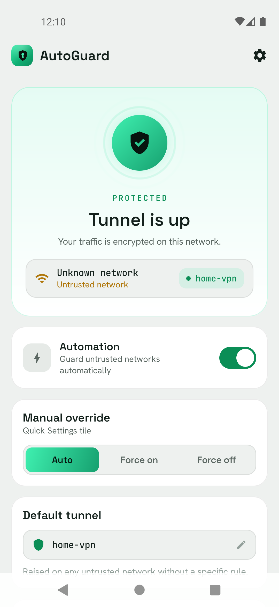
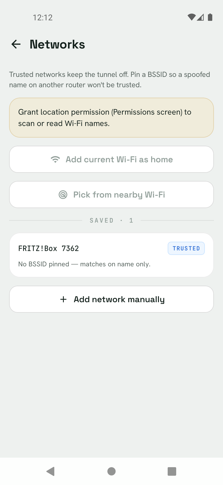
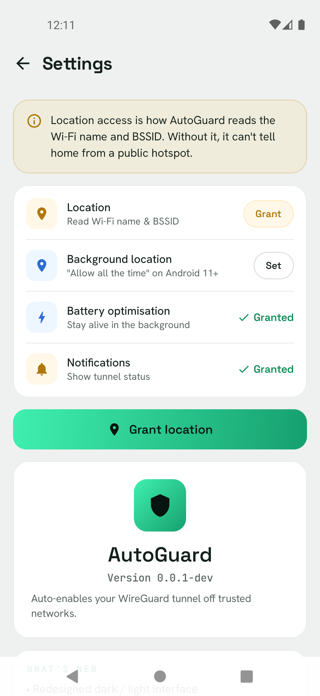
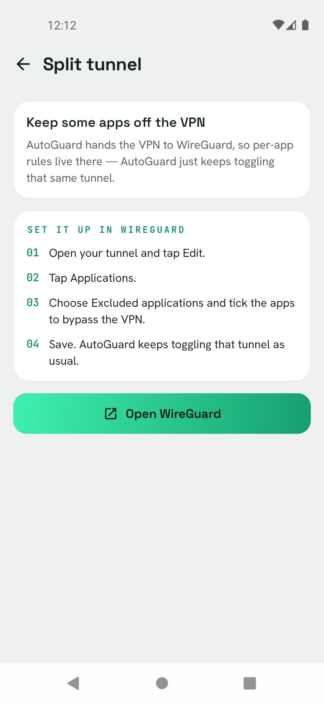

<h1 align="center">
  
  <br>
  AutoGuard
</h1>

<p align="center"><strong>Automatic WireGuard, only when you need it.</strong></p>

<div align="center">

[](https://github.com/smellouk/AutoGuard/releases/latest)
[](https://github.com/smellouk/AutoGuard/releases)
[](https://github.com/smellouk/AutoGuard/stargazers)
[](LICENSE)

</div>

<p align="center">
AutoGuard turns your WireGuard tunnel <strong>on</strong> the moment you leave a trusted Wi-Fi,
and <strong>off</strong> again when you get home - automatically, in the background, using almost no battery.
</p>

---

AutoGuard does the **smart part** - detecting which network you're on - and hands the
**actual VPN work to the official [WireGuard](https://www.wireguard.com/) app** via its
intent API. The result: AutoGuard needs **no VPN permission of its own**, ships as a tiny
APK, and the always-on monitor idles at a few hundred KB of RAM.

> **Why not just leave the VPN always on?** Because routing home traffic through your own
> tunnel is pointless overhead, and many "always-on" setups silently drop on reboot.
> AutoGuard is *armed* all the time but only *protects* when you're actually exposed.

<div align="center">

### Signing certificate fingerprints

Use these to verify the APK signature before installing.

```
68:60:4D:40:E0:97:3C:BC:40:58:0C:5A:F7:8F:6B:B4:3F:4B:E1:FE:39:22:4D:DF:91:39:0A:8B:DD:7E:E4:75
```

</div>

## 📸 Screenshots

<div align="center">

| Protected | Networks | Permissions | Split tunnel |
|:---:|:---:|:---:|:---:|
|  |  |  |  |

</div>

## ✨ Features

| | |
|---|---|
| 🛡️ **Trusted-network automation** | Tunnel **off** on your home Wi-Fi, **on** everywhere else - no taps. |
| 📌 **BSSID pinning** | Pin a router's MAC so a spoofed SSID on another router isn't trusted. |
| 🎚️ **Manual override** | A 3-way switch (Auto / Force on / Force off) in-app **and** as a Quick Settings tile. |
| 🔀 **Per-network tunnels** | Different (or multiple) tunnels per network, with a global default. |
| 🧾 **Event log** | The last 200 transitions with timestamps - full transparency. |
| 📡 **Live Wi-Fi picker** | Add networks by typing, from the current connection, or a nearby scan. |
| 🌗 **Dark & light themes** | A "calm-precision" design that follows the system setting. |
| 🌍 **Localised** | English, French, Arabic (RTL). |

## 🧠 How it works

- A minimal **foreground service** registers a single `ConnectivityManager.NetworkCallback`.
  There's **no polling, no timer, no wake lock** - the OS only wakes the app when the
  network actually changes.
- On each change it reads the network, runs a **pure decision function** (`TunnelDecider`),
  and only fires an intent to WireGuard when the desired state *changes* (no spamming).
- It's **Direct Boot aware**: the monitor restarts at `LOCKED_BOOT_COMPLETED` (before unlock)
  and survives reboots; config lives in device-protected storage.

### Decision rules

| You're on… | Tunnel |
|---|---|
| A trusted home network (SSID - and BSSID, if pinned) | **OFF** |
| An untrusted network with a per-network rule | that rule's tunnel(s) **ON** |
| Any other Wi-Fi | default tunnel(s) **ON** |
| Wi-Fi with an unreadable name/BSSID | ON / leave alone *(configurable)* |
| Mobile data | ON / OFF *(configurable)* |
| No connection | leave alone |
| **Manual override = Force ON / Force OFF** | overrides everything above |

## 🚀 Getting started

1. Install the **official WireGuard app** and create your tunnel in it.
2. In WireGuard: **Settings → Advanced → "Allow remote control apps" = ON**
   *(the same intents Tasker uses - so AutoGuard needs no VPN permission itself).*
3. Open AutoGuard and follow the **onboarding**:
   - Set the **default tunnel** name (exactly as in WireGuard).
   - Add your **home Wi-Fi** (*Add current Wi-Fi as home*), optionally *Pin current BSSID*.
   - **Grant location** - Android requires it to read the Wi-Fi name/BSSID
     (set *Allow all the time* for background matching).
   - Optionally **disable battery optimisation** so the monitor is never killed.

> **Automation can't be enabled** until there's both a default tunnel **and** a trusted
> network - otherwise it would be a no-op. The toggle (and the tile) tell you what's missing.

## 🏗️ Build

The Gradle wrapper is committed:

```bash
./gradlew assembleDebug        # debug APK   → app/build/outputs/apk/debug/
./gradlew testDebugUnitTest    # decision-logic unit tests
./gradlew assembleRelease      # signed release APK (needs keystore.properties)
```

**Tech stack**

| | |
|---|---|
| Language | **Kotlin 2.4** |
| UI | **Jetpack Compose** (Material 3, Compose BOM 2026.05) |
| Build | **AGP 9.2.1**, **Gradle 9.4.1**, version catalog (`gradle/libs.versions.toml`) |
| SDK | `minSdk 26` (Android 8.0) · `compileSdk`/`targetSdk 37` |
| Package | `com.smellouk.autoguard` |
| Dependencies | AndroidX + Compose only - **no networking libraries** |

## 🧩 Architecture

A **layered, functional-core / imperative-shell** design - not MVVM ceremony, but reactive
where it matters:

```
net/        Pure logic - TunnelDecider, NetworkRule, NetworkState (no Android deps, unit-tested)
data/       Settings + EventLog (device-protected SharedPreferences)
service/    WifiMonitorService (one NetworkCallback) · BootReceiver · OverrideReceiver
qs/         Quick Settings tiles (override cycle + automation toggle)
wireguard/  WireGuardController (intent facade)
ui/         Compose - theme/ · components/ · screens/ · home/HomeViewModel (StateFlow)
```

The **Home screen is reactive** (MVVM-lite): a `HomeViewModel` combines Settings changes +
network changes into one `StateFlow<HomeUiState>`, so the hero updates the instant Wi-Fi
changes. The tunnel **decision logic is a pure function**, reused by both the service
(authoritative) and the UI (display) and covered by unit tests.

## 🎨 Design

Dark "calm-precision" privacy aesthetic with a matching light theme. Accent colour carries
meaning everywhere: **green = protected/on**, **blue = trusted/home**, **amber = needs
attention/untrusted**, **red = destructive**.

- **Tokens** in `ui/theme/Theme.kt` as `AutoGuardColors`, provided via `CompositionLocal` (`AG.colors`).
- **Fonts** (bundled, OFL): Space Grotesk (UI/headings), Hanken Grotesk (body),
  JetBrains Mono (all technical data - SSIDs, BSSIDs, tunnels, timestamps).
- **State-driven hero** (Protected / At-home / Off); pulse rings + breathing glow animate
  only when protected, and honour the system **reduce-motion** setting.

## 📦 Releasing

Push a version tag and GitHub Actions does the rest:

```bash
git tag v1.4.2 && git push origin v1.4.2
```

`.github/workflows/release.yml` builds a signed APK, derives the **versionName** from the tag
(`v1.4.2 → 1.4.2`) and a monotonic **versionCode** from the run number, generates release
notes with [**git-cliff**](https://git-cliff.org), and attaches `AutoGuard-v1.4.2.apk` to the
GitHub Release.

<details>
<summary><b>Signing &amp; required secrets</b></summary>

Signing material resolves in order, so one `build.gradle.kts` works locally and in CI:

1. **Env vars** (`KEYSTORE_FILE`, `KEYSTORE_PASSWORD`, `KEY_ALIAS`, `KEY_PASSWORD`) - CI.
2. **`keystore.properties`** at the repo root - local release builds.
3. Neither present → release is left unsigned.

`release.keystore` and `keystore.properties` are **git-ignored** - never commit them.

Repo secrets (Settings → Secrets and variables → Actions):

| Secret | Value |
|---|---|
| `KEYSTORE_BASE64` | base64 of `release.keystore` (`base64 -i release.keystore`) |
| `KEYSTORE_PASSWORD` | the store password |
| `KEY_ALIAS` | `autoguard` |
| `KEY_PASSWORD` | the key password |

</details>

<details>
<summary><b>Changelog conventions</b></summary>

Release notes come from [git-cliff](https://git-cliff.org) (`cliff.toml`), grouped by
[Conventional Commit](https://www.conventionalcommits.org) type (`feat:`, `fix:`, `perf:`,
`docs:`, `ci:`…). Non-conventional commits are skipped - so write messages accordingly.

```bash
git cliff -o CHANGELOG.md   # full history
git cliff --latest          # latest tag only
```

</details>

## ⚠️ Caveats (honest limitations)

- **Location is mandatory for SSID.** Android 10+ only reveals the Wi-Fi name with
  fine-location granted **and** location services on - Google's rule, not a choice.
  Without it AutoGuard falls back to the "treat unknown Wi-Fi as untrusted" toggle.
- **Persistent notification.** The always-on monitor shows a silent, minimal foreground
  notification - mandatory on modern Android for an indefinitely-running process.
- **Some things WireGuard doesn't expose.** AutoGuard can't read WireGuard's tunnel list,
  per-app split-tunnel rules, or whether a toggle succeeded (the intent API is one-way).
  So those are surfaced as guidance/deep-links, not detected.
- **BSSID pinning is defence-in-depth.** MACs can be cloned; it raises the bar against SSID
  spoofing but the tunnel's own cryptographic identity is the real guarantee.

## 📄 License

Licensed under the **Apache License 2.0** - see [`LICENSE`](LICENSE).

---

<div align="center">
<sub>Built with Kotlin + Jetpack Compose · WireGuard is a registered trademark of Jason A. Donenfeld.</sub>
</div>
